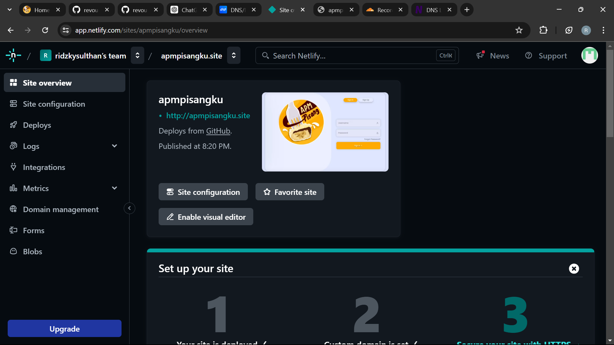
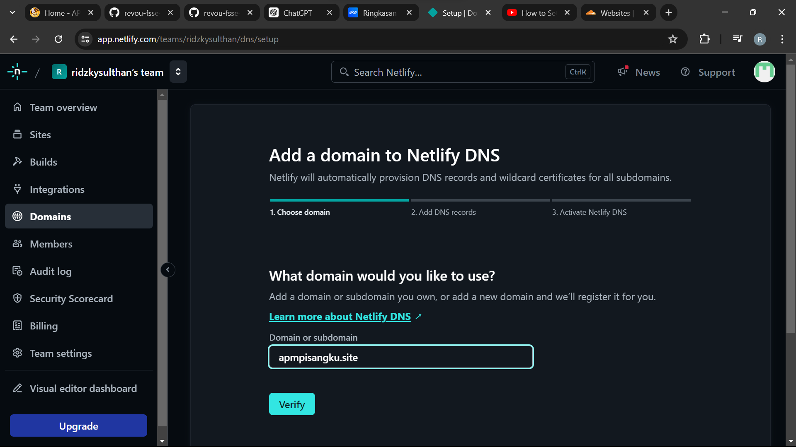
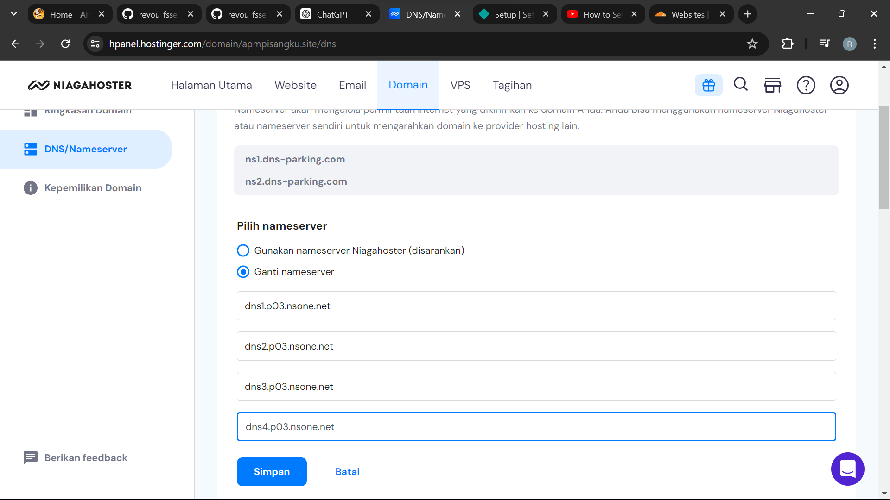
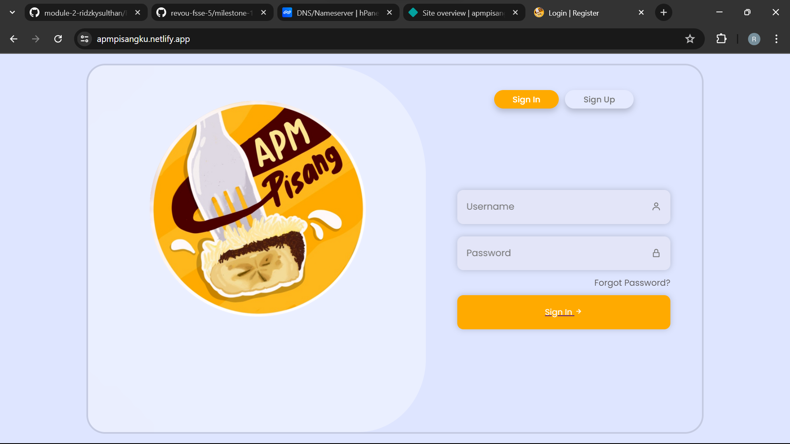

[](https://classroom.github.com/a/cvSOEAVD)
# Milestone 1 Ridzky Sulthan 

Selamat datang di website APM Pisang yang berisi tentang UMKM dari Bandung yang menjual produk olahan pisang menjadi cemilan.

## 🍌 Software & Tools 
| Software & Tools                                                                                                    |
|---------------------------------------------------------------------------------------------------------------------|
|            |
| 
               |


# 🍌Setup guide


**Clone the Repository:**

   ```bash
   git clone git@github.com:revou-fsse-5/milestone-1-ridzkysulthan.git
   ```

# 🍌Deployment & Custom Domain

1. Open dan deploy repo di Netlify [link](https://netlify.com)


2. Add external domain yang sudah dibeli dan masukan di netlify 


3. Ganti namaserver sesuai dengan repo yang ada di netlify


4. Website siap dengan custom domain
